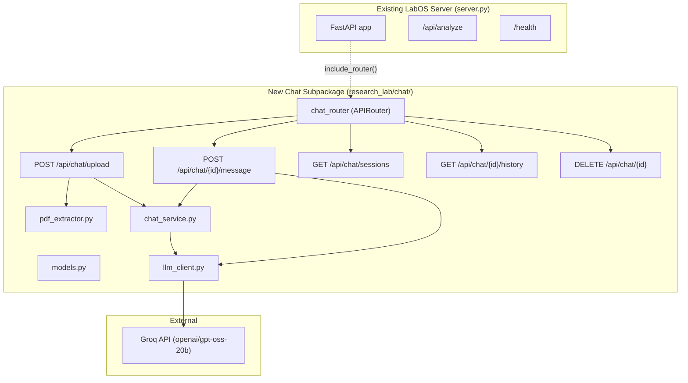
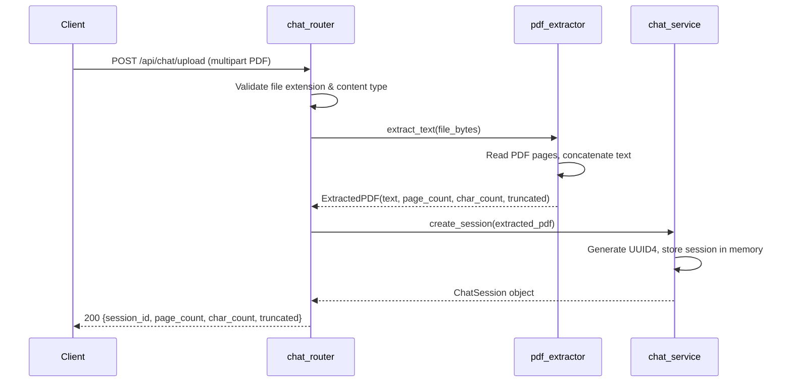
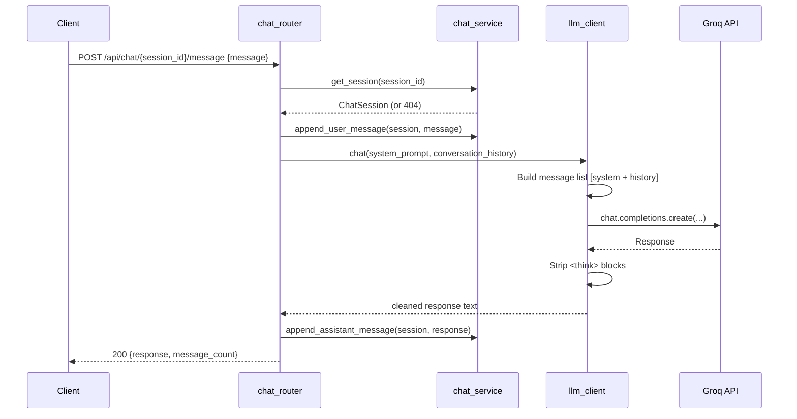

# Design Document — PDF Research Chat

## Overview

The PDF Research Chat feature adds a self-contained, backend-only chat module to the LabOS Research Analysis Engine. After the multi-agent pipeline produces a final report, researchers can upload that PDF and start an interactive conversation with the Groq LLM (`openai/gpt-oss-20b`), using the extracted PDF text as grounding context.

The module is implemented as a new `research_lab/chat/` subpackage — **zero modifications to existing files**. It exposes a FastAPI `APIRouter` that the host application can mount with a single `app.include_router(...)` call. All state is in-memory (dict keyed by UUID4 session IDs), matching the project's existing no-database constraint.

**Key design decisions:**
- **PyPDF2** for PDF text extraction — it's lightweight, pure-Python, well-maintained, and sufficient for text-based research PDFs. pdfplumber is heavier and optimized for table extraction, which is not needed here.
- **Synchronous execution** throughout, consistent with the project's steering.md constraint (no async/await in business logic).
- **Groq client pattern** mirrors the existing `orchestrator.py` — lazy singleton, `_safe_json()` helper, `<think>` block stripping.
- **60,000 character context limit** to stay within Groq model token limits while providing substantial PDF context.

## Architecture



### Request Flow — Upload



### Request Flow — Chat Message



## Components and Interfaces

### File Structure

```
research_lab/chat/
├── __init__.py          # Exports chat_router for mounting
├── models.py            # Pydantic models and TypedDicts
├── pdf_extractor.py     # PDF text extraction (PyPDF2)
├── llm_client.py        # Groq API wrapper (singleton pattern)
├── chat_service.py      # Session management (in-memory store)
├── router.py            # FastAPI APIRouter with all endpoints
└── README.md            # Integration guide
```

### Component Interfaces

#### `pdf_extractor.py`

```python
from dataclasses import dataclass

@dataclass
class ExtractedPDF:
    text: str
    page_count: int
    char_count: int
    truncated: bool

MAX_TEXT_LENGTH = 60_000

def extract_text(file_bytes: bytes) -> ExtractedPDF:
    """
    Extract all text from a PDF file.
    
    Args:
        file_bytes: Raw bytes of the uploaded PDF file.
    
    Returns:
        ExtractedPDF with concatenated text, page count, char count,
        and whether truncation occurred.
    
    Raises:
        ValueError: If the file is not a valid PDF, is password-protected,
                    or contains no extractable text.
    """
```

#### `llm_client.py`

```python
from typing import List, Dict

MODEL = "openai/gpt-oss-20b"
TIMEOUT = 60  # seconds

def get_chat_response(
    system_prompt: str,
    conversation_history: List[Dict[str, str]],
) -> str:
    """
    Send a chat completion request to Groq.
    
    Args:
        system_prompt: System message containing PDF context.
        conversation_history: List of {"role": "user"|"assistant", "content": "..."} dicts.
    
    Returns:
        Cleaned assistant response text (think blocks stripped).
    
    Raises:
        TimeoutError: If the Groq API does not respond within TIMEOUT seconds.
        RuntimeError: If the Groq API call fails for any other reason.
        EnvironmentError: If GROQ_API_KEY is not set.
    """
```

#### `chat_service.py`

```python
from typing import Dict, List, Optional
from models import ChatSession, SessionSummary

# In-memory session store
_sessions: Dict[str, ChatSession] = {}

def create_session(text: str, page_count: int, char_count: int, truncated: bool) -> ChatSession:
    """Create a new chat session with extracted PDF context. Returns the session."""

def get_session(session_id: str) -> Optional[ChatSession]:
    """Retrieve a session by ID. Returns None if not found."""

def delete_session(session_id: str) -> bool:
    """Delete a session. Returns True if deleted, False if not found."""

def list_sessions() -> List[SessionSummary]:
    """Return summary metadata for all active sessions."""

def append_user_message(session: ChatSession, content: str) -> None:
    """Append a user message to the session's conversation history."""

def append_assistant_message(session: ChatSession, content: str) -> None:
    """Append an assistant message to the session's conversation history."""

def build_system_prompt(session: ChatSession) -> str:
    """Build the system prompt containing PDF context and instructions."""
```

#### `router.py`

```python
from fastapi import APIRouter

chat_router = APIRouter(prefix="/api/chat", tags=["chat"])

# POST /api/chat/upload           — Upload PDF, create session
# POST /api/chat/{session_id}/message  — Send chat message
# GET  /api/chat/sessions         — List active sessions
# GET  /api/chat/{session_id}/history  — Get conversation history
# DELETE /api/chat/{session_id}   — Delete session
```

#### `__init__.py`

```python
from .router import chat_router

__all__ = ["chat_router"]
```

### Integration Point

To mount the chat feature on the existing server, a developer adds two lines to `server.py`:

```python
from chat import chat_router
app.include_router(chat_router)
```

This is documented in `research_lab/chat/README.md` but **not** applied automatically — the constraint is zero modifications to existing files.

## Data Models

### Pydantic Request/Response Models (`models.py`)

```python
from pydantic import BaseModel, field_validator
from typing import List, Optional
from datetime import datetime


class ChatMessageRequest(BaseModel):
    """Request body for POST /api/chat/{session_id}/message"""
    message: str

    @field_validator("message")
    @classmethod
    def validate_message(cls, v: str) -> str:
        v = v.strip()
        if len(v) < 1:
            raise ValueError("Message must not be empty.")
        if len(v) > 4000:
            raise ValueError("Message must be at most 4,000 characters.")
        return v


class UploadResponse(BaseModel):
    """Response for POST /api/chat/upload"""
    session_id: str
    page_count: int
    char_count: int
    truncated: bool


class ChatMessageResponse(BaseModel):
    """Response for POST /api/chat/{session_id}/message"""
    response: str
    message_count: int


class SessionInfo(BaseModel):
    """Single session entry in the sessions list"""
    session_id: str
    created_at: str  # ISO 8601 timestamp
    page_count: int
    char_count: int
    truncated: bool


class SessionListResponse(BaseModel):
    """Response for GET /api/chat/sessions"""
    sessions: List[SessionInfo]


class ConversationMessage(BaseModel):
    """Single message in conversation history"""
    role: str  # "user" or "assistant"
    content: str


class HistoryResponse(BaseModel):
    """Response for GET /api/chat/{session_id}/history"""
    session_id: str
    messages: List[ConversationMessage]
    message_count: int


class DeleteResponse(BaseModel):
    """Response for DELETE /api/chat/{session_id}"""
    deleted: bool
    session_id: str


class ErrorResponse(BaseModel):
    """Standard error response body"""
    detail: str
```

### Internal Data Structures

```python
from dataclasses import dataclass, field
from datetime import datetime
from typing import List, Dict


@dataclass
class ChatSession:
    """In-memory chat session object"""
    session_id: str                          # UUID4 string
    pdf_text: str                            # Extracted PDF content
    page_count: int                          # Number of pages in source PDF
    char_count: int                          # Character count of extracted text
    truncated: bool                          # Whether text was truncated at 60k chars
    created_at: datetime                     # Session creation timestamp
    conversation_history: List[Dict[str, str]] = field(default_factory=list)
    # Each entry: {"role": "user"|"assistant", "content": "..."}


@dataclass
class SessionSummary:
    """Lightweight session metadata for listing"""
    session_id: str
    created_at: str   # ISO 8601
    page_count: int
    char_count: int
    truncated: bool
```

### System Prompt Template

```python
SYSTEM_PROMPT_TEMPLATE = """You are a research assistant helping a scientist analyze a PDF research document. 
Answer questions based ONLY on the content of the provided PDF document below.

If a question asks about something not covered in the PDF, clearly state that the information is not available in the provided document.

Be precise, cite specific sections or findings from the document when possible, and maintain a scientific tone.

--- PDF CONTENT START ---
{pdf_text}
--- PDF CONTENT END ---

{truncation_notice}"""

TRUNCATION_NOTICE = "Note: The PDF content was truncated to fit context limits. Some content from later pages may be missing."
```


## Correctness Properties

*A property is a characteristic or behavior that should hold true across all valid executions of a system — essentially, a formal statement about what the system should do. Properties serve as the bridge between human-readable specifications and machine-verifiable correctness guarantees.*

### Property 1: PDF text extraction preserves page-ordered content

*For any* valid PDF with N pages (N ≥ 1), each containing known text content, `extract_text` SHALL return a single string where the text from page *i* appears before the text from page *i+1*, and pages are separated by newline characters.

**Validates: Requirements 1.1, 1.2**

### Property 2: Invalid bytes are rejected

*For any* byte sequence that is not a valid PDF file, `extract_text` SHALL raise a `ValueError` indicating the file is not a valid PDF.

**Validates: Requirements 1.3**

### Property 3: Text truncation at 60,000 characters

*For any* valid PDF whose extracted text exceeds 60,000 characters, the returned `ExtractedPDF` SHALL have `text` of exactly 60,000 characters, and `truncated` set to `True`. For any PDF whose text is ≤ 60,000 characters, `truncated` SHALL be `False` and the full text SHALL be returned.

**Validates: Requirements 1.5**

### Property 4: Session creation invariants

*For any* valid extracted PDF parameters (text, page_count, char_count, truncated), `create_session` SHALL produce a `ChatSession` where: (a) `session_id` is a valid UUID4 string, (b) `pdf_text` equals the input text, (c) `page_count` and `char_count` match the inputs, (d) `truncated` matches the input, and (e) `conversation_history` is an empty list.

**Validates: Requirements 1.6, 1.7, 2.2, 2.4**

### Property 5: Conversation history preserves message order and roles

*For any* sequence of N user messages and N assistant messages appended alternately to a session's conversation history, the history SHALL contain exactly 2N entries where entry at index 2k has role "user" and entry at index 2k+1 has role "assistant", and each entry's content matches the original message.

**Validates: Requirements 2.5, 2.6**

### Property 6: Session deletion makes session unretrievable

*For any* created session, after `delete_session(session_id)` returns `True`, `get_session(session_id)` SHALL return `None`.

**Validates: Requirements 2.8**

### Property 7: Message list construction includes system prompt, history, and new message

*For any* session with K messages in its conversation history and any new user message string, the constructed message list SHALL have length K + 2 (1 system + K history + 1 new user), where the first message has role "system" and contains the session's PDF text, messages at indices 1 through K match the conversation history, and the last message has role "user" with the new message content.

**Validates: Requirements 3.1**

### Property 8: Think block stripping

*For any* string containing zero or more `<think>...</think>` blocks interspersed with non-think content, the stripping function SHALL remove all `<think>...</think>` blocks (including nested content) and preserve all text outside those blocks.

**Validates: Requirements 3.4**

### Property 9: File upload validation rejects non-PDF files

*For any* uploaded file whose filename does not end with `.pdf` or whose content type is not `application/pdf`, the upload endpoint SHALL reject the file with an HTTP 400 error.

**Validates: Requirements 6.4**

### Property 10: Message length validation

*For any* string, the message validator SHALL accept it if and only if its stripped length is between 1 and 4,000 characters (inclusive). Strings that are empty after stripping or exceed 4,000 characters SHALL be rejected.

**Validates: Requirements 6.5**

## Error Handling

### Error Response Strategy

All errors return a JSON body with a `detail` field, consistent with FastAPI's default error format. The chat module uses FastAPI's `HTTPException` for all error responses.

| Scenario | HTTP Status | Detail Message |
|----------|-------------|----------------|
| File is not a valid PDF | 400 | "The uploaded file is not a valid PDF." |
| File has wrong extension/content type | 400 | "File must be a PDF (application/pdf)." |
| Corrupted or password-protected PDF | 400 | "Cannot read PDF: {specific reason}." |
| PDF has no extractable text | 422 | "The PDF contains no extractable text (may be image-only)." |
| Request body validation failure | 422 | Field-level details (FastAPI/Pydantic automatic) |
| Session not found | 404 | "Session {session_id} not found." |
| GROQ_API_KEY not set | 503 | "Chat service unavailable: LLM API key not configured." |
| Groq API call failure | 502 | "LLM service error: unable to get response." |
| Groq API timeout (>60s) | 504 | "LLM service timeout: request took too long." |
| Unexpected internal error | 500 | "Internal server error." (no internal details exposed) |

### Error Handling Patterns

```python
# Pattern 1: PDF extraction errors (pdf_extractor.py)
# Raises ValueError with descriptive messages — router catches and maps to HTTP status

# Pattern 2: Groq API errors (llm_client.py)
# Raises specific exceptions — router catches and maps:
#   EnvironmentError  → 503
#   TimeoutError      → 504
#   RuntimeError      → 502

# Pattern 3: Catch-all in router
# Every endpoint has a top-level try/except that catches Exception
# and returns 500 with a generic message, matching the existing
# server.py pattern.
```

### Logging

The chat module uses Python's built-in `logging` module with a logger named `"research_lab.chat"`. Errors are logged at `ERROR` level with full exception details. Normal operations (session creation, deletion) are logged at `INFO` level. No sensitive data (PDF content, message content) is included in log messages.

## Testing Strategy

### Testing Framework

- **pytest** for all tests
- **Hypothesis** (Python property-based testing library) for property-based tests
- Tests live in `research_lab/tests/test_chat/` to keep them alongside existing test infrastructure

### Property-Based Tests

Each correctness property from the design document maps to a single Hypothesis test. All property tests run a minimum of 100 iterations.

| Property | Test File | Strategy |
|----------|-----------|----------|
| P1: PDF extraction preserves page order | `test_pdf_extractor.py` | Generate multi-page PDFs with `reportlab` or `fpdf2` in the test, extract, verify order |
| P2: Invalid bytes rejected | `test_pdf_extractor.py` | Generate random byte sequences via `st.binary()`, verify ValueError |
| P3: Truncation at 60k chars | `test_pdf_extractor.py` | Generate PDFs with text length > 60k, verify truncation |
| P4: Session creation invariants | `test_chat_service.py` | Generate random text/metadata, create session, verify all fields |
| P5: History ordering | `test_chat_service.py` | Generate random message sequences, verify order and roles |
| P6: Deletion removes session | `test_chat_service.py` | Create then delete, verify None on get |
| P7: Message list construction | `test_chat_service.py` | Generate sessions with varying history, verify list structure |
| P8: Think block stripping | `test_llm_client.py` | Generate strings with embedded `<think>` blocks, verify removal |
| P9: File validation | `test_router.py` | Generate filenames with various extensions, verify acceptance/rejection |
| P10: Message length validation | `test_models.py` | Generate strings of varying lengths, verify validation boundary |

Tag format for each test:
```python
# Feature: pdf-research-chat, Property 1: PDF text extraction preserves page-ordered content
```

### Unit Tests (Example-Based)

| Scenario | Test File |
|----------|-----------|
| Image-only PDF returns 422 | `test_pdf_extractor.py` |
| Non-existent session returns 404 | `test_router.py` |
| Groq API failure returns 502 | `test_router.py` |
| Groq API timeout returns 504 | `test_router.py` |
| Missing GROQ_API_KEY returns 503 | `test_router.py` |
| System prompt contains required instructions | `test_chat_service.py` |
| All 5 endpoints are routable | `test_router.py` |
| Validation error returns 422 | `test_router.py` |
| Corrupted PDF returns 400 | `test_pdf_extractor.py` |
| Password-protected PDF returns 400 | `test_pdf_extractor.py` |

### Integration Tests

| Scenario | Test File |
|----------|-----------|
| Full upload → message → history → delete flow | `test_integration.py` |
| Multiple concurrent sessions | `test_integration.py` |

### Test Dependencies

- `pytest` — test runner
- `hypothesis` — property-based testing
- `httpx` — FastAPI TestClient async support (or use `fastapi.testclient.TestClient`)
- `fpdf2` or `reportlab` — generate test PDFs programmatically (test-only dependency)
- `unittest.mock` — mock Groq API calls
