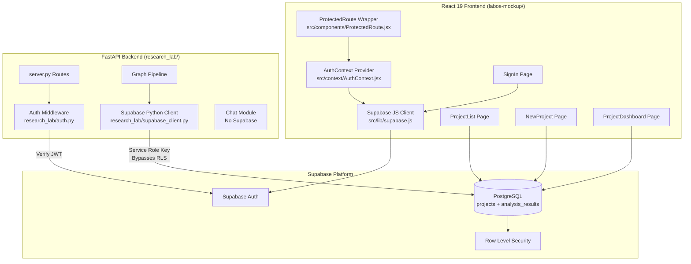
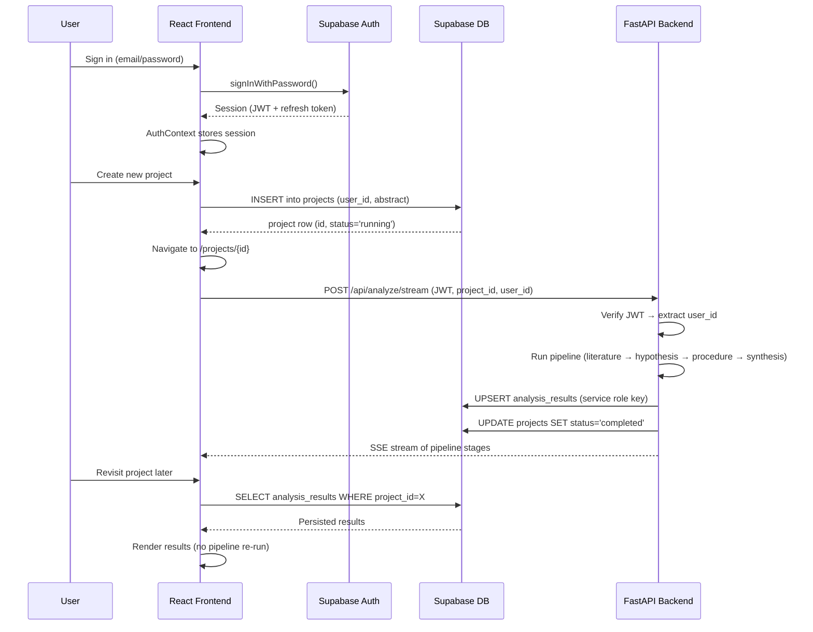

# Design Document — Supabase Integration for LabOS

## Overview

This design integrates Supabase across the LabOS platform to provide user authentication, project persistence, analysis results storage, Row Level Security (RLS), and backend/frontend middleware. The React 19 frontend gains a Supabase JS client for auth and database reads, while the Python FastAPI backend gains a Supabase Python client for server-side writes using the service role key. Chat sessions remain ephemeral (in-memory only) and are explicitly excluded from persistence.

The integration touches three layers:
1. **Database layer** — Two new Supabase tables (`projects`, `analysis_results`) with RLS policies
2. **Frontend layer** — Supabase JS client, Auth context, protected routes, authenticated API calls
3. **Backend layer** — Supabase Python client, JWT verification middleware, results persistence after pipeline completion



## Architecture

### Frontend Architecture

The frontend adds four new modules to the existing React 19 + Vite app:

1. **`src/lib/supabase.js`** — Singleton Supabase client initialized from `VITE_SUPABASE_URL` and `VITE_SUPABASE_ANON_KEY`. Throws at module load if either variable is missing.

2. **`src/context/AuthContext.jsx`** — React context provider wrapping the app. Subscribes to `onAuthStateChange`, exposes `{ user, session, loading }`, and handles automatic session restoration and token refresh.

3. **`src/components/ProtectedRoute.jsx`** — Route wrapper that checks `AuthContext`. Redirects unauthenticated users to `/` (sign-in). Shows a loading spinner while session is being checked.

4. **Updated pages** — `SignIn.jsx` gains real email/password auth + sign-up. `ProjectList.jsx` queries Supabase for projects. `NewProject.jsx` inserts into Supabase. `ProjectDashboard.jsx` loads persisted results or runs the pipeline.

### Backend Architecture

The backend adds two new modules:

1. **`research_lab/supabase_client.py`** — Lazy singleton Supabase Python client using `SUPABASE_URL` and `SUPABASE_SERVICE_ROLE_KEY`. Provides functions to upsert analysis results and update project status. All write failures are logged but never raise — the pipeline continues regardless.

2. **`research_lab/auth.py`** — FastAPI dependency that extracts and verifies the JWT from the `Authorization: Bearer <token>` header. Returns the `user_id` claim. Applied to `/api/analyze` and `/api/analyze/stream` endpoints only. `/health` and `/api/chat/*` remain unauthenticated.

### Data Flow



## Components and Interfaces

### Frontend Components

#### `src/lib/supabase.js`
```javascript
// Singleton Supabase client
import { createClient } from '@supabase/supabase-js';

const supabaseUrl = import.meta.env.VITE_SUPABASE_URL;
const supabaseAnonKey = import.meta.env.VITE_SUPABASE_ANON_KEY;

if (!supabaseUrl) throw new Error('Missing VITE_SUPABASE_URL environment variable');
if (!supabaseAnonKey) throw new Error('Missing VITE_SUPABASE_ANON_KEY environment variable');

export const supabase = createClient(supabaseUrl, supabaseAnonKey);
```

#### `src/context/AuthContext.jsx`
```javascript
// Provides: { user, session, loading, signOut }
// Subscribes to onAuthStateChange for automatic session sync
// Wraps the entire app in main.jsx
```

**Interface:**
| Export | Type | Description |
|--------|------|-------------|
| `AuthProvider` | Component | Context provider wrapping children |
| `useAuth()` | Hook | Returns `{ user, session, loading }` |

#### `src/components/ProtectedRoute.jsx`
```javascript
// Wraps <Outlet /> — redirects to "/" if !user && !loading
// Shows loading spinner while loading === true
```

#### Updated `SignIn.jsx`
- Email + password fields (currently only email)
- `supabase.auth.signInWithPassword({ email, password })`
- `supabase.auth.signUp({ email, password })` toggle
- Error display on auth failure
- Redirect to `/projects` if already authenticated

#### Updated `ProjectList.jsx`
- `supabase.from('projects').select('*').order('created_at', { ascending: false })`
- Loading state while query runs
- Empty state with "Create New Project" card (already exists)
- Status badge per project

#### Updated `NewProject.jsx`
- `supabase.from('projects').insert({ user_id, name: 'Untitled Project', abstract, status: 'running' })`
- Navigate to `/projects/{id}` on success
- Error display on failure

#### Updated `ProjectDashboard.jsx`
- On mount: query `analysis_results` for the project
- If results exist: render them directly (no pipeline call)
- If no results: run pipeline via SSE as currently implemented
- Pass `project_id` and `user_id` in the analyze request body
- Include JWT in Authorization header

### Backend Components

#### `research_lab/supabase_client.py`
```python
# Lazy singleton using SUPABASE_URL + SUPABASE_SERVICE_ROLE_KEY
# Functions:
#   get_client() -> Client  (raises EnvironmentError if env vars missing)
#   save_analysis_results(project_id, user_id, results) -> None  (swallows errors)
#   update_project_status(project_id, status) -> None  (swallows errors)
```

**Interface:**
| Function | Args | Returns | Raises |
|----------|------|---------|--------|
| `get_client()` | — | `Client` | `EnvironmentError` if env vars missing |
| `save_analysis_results(project_id, user_id, results)` | project_id: str, user_id: str, results: dict | `None` | Never (logs errors) |
| `update_project_status(project_id, status)` | project_id: str, status: str | `None` | Never (logs errors) |

#### `research_lab/auth.py`
```python
# FastAPI dependency for JWT verification
# Uses Supabase's JWKS endpoint or shared JWT secret to verify tokens
# Returns user_id from token claims
```

**Interface:**
| Function | Args | Returns | Raises |
|----------|------|---------|--------|
| `get_current_user(request)` | FastAPI Request | `str` (user_id) | `HTTPException(401)` if invalid/missing |

#### Updated `research_lab/server.py`
- `AnalyzeRequest` gains `project_id: str` and `user_id: str` fields
- `/api/analyze` and `/api/analyze/stream` use `Depends(get_current_user)`
- After pipeline completes: call `save_analysis_results()` and `update_project_status()`
- `/health` and `/api/chat/*` remain unauthenticated

### API Contract Changes

| Endpoint | Auth | Body Changes |
|----------|------|-------------|
| `POST /api/analyze` | JWT required | Add `project_id`, `user_id` |
| `POST /api/analyze/stream` | JWT required | Add `project_id`, `user_id` |
| `GET /health` | None | No change |
| `POST /api/chat/*` | None | No change |
| `GET /api/chat/*` | None | No change |
| `DELETE /api/chat/*` | None | No change |

## Data Models

### Supabase Database Schema

#### `projects` Table
```sql
CREATE TABLE projects (
    id          UUID PRIMARY KEY DEFAULT gen_random_uuid(),
    user_id     UUID NOT NULL REFERENCES auth.users(id),
    name        TEXT NOT NULL,
    abstract    TEXT NOT NULL,
    status      TEXT NOT NULL DEFAULT 'running',
    created_at  TIMESTAMPTZ DEFAULT now(),
    updated_at  TIMESTAMPTZ DEFAULT now()
);

-- RLS: users can only access their own projects
ALTER TABLE projects ENABLE ROW LEVEL SECURITY;

CREATE POLICY "Users can select own projects"
    ON projects FOR SELECT
    USING (auth.uid() = user_id);

CREATE POLICY "Users can insert own projects"
    ON projects FOR INSERT
    WITH CHECK (auth.uid() = user_id);

CREATE POLICY "Users can update own projects"
    ON projects FOR UPDATE
    USING (auth.uid() = user_id);

CREATE POLICY "Users can delete own projects"
    ON projects FOR DELETE
    USING (auth.uid() = user_id);
```

#### `analysis_results` Table
```sql
CREATE TABLE analysis_results (
    id                    UUID PRIMARY KEY DEFAULT gen_random_uuid(),
    project_id            UUID NOT NULL UNIQUE REFERENCES projects(id),
    user_id               UUID NOT NULL REFERENCES auth.users(id),
    literature            JSONB,
    hypothesis            JSONB,
    procedure             JSONB,
    final_recommendation  TEXT,
    confidence_level      TEXT,
    action_items          JSONB DEFAULT '[]',
    caveats               JSONB DEFAULT '[]',
    created_at            TIMESTAMPTZ DEFAULT now()
);

-- RLS: users can read their own results
ALTER TABLE analysis_results ENABLE ROW LEVEL SECURITY;

CREATE POLICY "Users can select own results"
    ON analysis_results FOR SELECT
    USING (auth.uid() = user_id);

-- Backend writes use service role key (bypasses RLS)
-- No INSERT/UPDATE policies needed for authenticated users
```

### TypeScript/JavaScript Types (Frontend)

```typescript
interface Project {
    id: string;           // UUID
    user_id: string;      // UUID
    name: string;
    abstract: string;
    status: 'running' | 'completed' | 'error';
    created_at: string;   // ISO 8601
    updated_at: string;   // ISO 8601
}

interface AnalysisResults {
    id: string;
    project_id: string;
    user_id: string;
    literature: LiteratureOutput | null;
    hypothesis: HypothesisOutput | null;
    procedure: ProcedureOutput | null;
    final_recommendation: string | null;
    confidence_level: 'High' | 'Moderate' | 'Low' | null;
    action_items: string[];
    caveats: string[];
    created_at: string;
}
```

### Environment Variables

| Variable | Layer | Required | Description |
|----------|-------|----------|-------------|
| `VITE_SUPABASE_URL` | Frontend | Yes | Supabase project URL |
| `VITE_SUPABASE_ANON_KEY` | Frontend | Yes | Supabase anon/public key (safe for browser) |
| `SUPABASE_URL` | Backend | Yes | Supabase project URL |
| `SUPABASE_SERVICE_ROLE_KEY` | Backend | Yes | Service role key (server-side only, bypasses RLS) |


## Correctness Properties

*A property is a characteristic or behavior that should hold true across all valid executions of a system — essentially, a formal statement about what the system should do. Properties serve as the bridge between human-readable specifications and machine-verifiable correctness guarantees.*

### Property 1: Project list rendering completeness

*For any* valid project object with a name, status, and created_at date, rendering the project list should produce output that contains the project's name, its status value, and a formatted date string.

**Validates: Requirements 9.2, 18.4**

### Property 2: Whitespace-only rename rejection

*For any* string composed entirely of whitespace characters (spaces, tabs, newlines, etc.), attempting to rename a project with that string should be rejected, and the project's displayed name should remain unchanged.

**Validates: Requirements 10.4**

### Property 3: Analysis results upsert data integrity

*For any* valid pipeline output containing literature, hypothesis, procedure, final_recommendation, confidence_level, action_items, and caveats fields, calling `save_analysis_results()` should pass all fields to the Supabase upsert call with the correct project_id and user_id, preserving the data without transformation loss.

**Validates: Requirements 11.1**

### Property 4: Supabase write error resilience

*For any* exception raised by the Supabase client during a write operation, `save_analysis_results()` and `update_project_status()` should catch the exception, log it, and return without raising — the caller should never observe an exception from these functions.

**Validates: Requirements 11.3**

### Property 5: JWT user_id extraction correctness

*For any* valid JWT containing a `sub` claim with a UUID string, the `get_current_user()` dependency should extract and return that exact UUID as the user_id.

**Validates: Requirements 14.2**

## Error Handling

### Frontend Error Handling

| Scenario | Behavior |
|----------|----------|
| Missing env vars (`VITE_SUPABASE_URL`, `VITE_SUPABASE_ANON_KEY`) | Throw descriptive error at module load — app won't start |
| Auth sign-in failure | Display error message on sign-in page, no navigation |
| Auth sign-up failure | Display error message on sign-in page, no navigation |
| Project insert failure | Display error toast/message, remain on new project page |
| Project rename failure | Display error message, revert displayed name to previous value |
| Projects query failure | Display error state in project list |
| Analysis results query failure | Fall back to showing pipeline input form |
| 401 response from analyze endpoints | Redirect to sign-in page |
| Session token expiry | Supabase client auto-refreshes via `onAuthStateChange` |

### Backend Error Handling

| Scenario | Behavior |
|----------|----------|
| Missing env vars (`SUPABASE_URL`, `SUPABASE_SERVICE_ROLE_KEY`) | `get_client()` raises `EnvironmentError` — fail fast at startup |
| Missing/invalid JWT on `/api/analyze` | Return 401 Unauthorized with descriptive message |
| Supabase write failure (analysis results) | Log error, continue returning pipeline results to frontend |
| Supabase write failure (project status update) | Log error, do not raise — pipeline response is unaffected |
| Pipeline execution failure | Update project status to `'error'`, return error in SSE stream |

### Design Decisions

1. **Write failures are non-fatal on the backend.** The pipeline's primary job is to return results to the user via SSE. Supabase persistence is a secondary concern. If the write fails, the user still sees their results in real-time — they just won't be persisted for later retrieval. This matches the existing archive pattern in `_archive/research_lab/supabase_client.py`.

2. **Auth is not required for chat endpoints.** Chat sessions are ephemeral and contain no user-specific persisted data. Adding auth would add latency and complexity for no security benefit.

3. **The frontend uses the anon key; the backend uses the service role key.** The anon key is safe for browser exposure because RLS enforces access control. The service role key bypasses RLS and is used only server-side for writes that the frontend cannot perform (inserting analysis results on behalf of the pipeline).

## Testing Strategy

### Unit Tests (Example-Based)

**Frontend (React Testing Library / Vitest):**
- `SignIn.jsx`: Test sign-in with valid credentials, sign-in error display, sign-up toggle, redirect when already authenticated
- `AuthContext.jsx`: Test session restoration on mount, `onAuthStateChange` subscription, user/session/loading exposure
- `ProtectedRoute.jsx`: Test redirect when unauthenticated, loading indicator during session check, pass-through when authenticated
- `ProjectList.jsx`: Test project query on mount, rendering projects, empty state, loading state
- `NewProject.jsx`: Test insert on submit, navigation on success, error display on failure
- `ProjectDashboard.jsx`: Test loading persisted results, falling back to pipeline when no results exist
- `supabase.js`: Test error thrown when env vars are missing

**Backend (pytest):**
- `supabase_client.py`: Test `get_client()` raises `EnvironmentError` on missing env vars, singleton behavior, `save_analysis_results()` calls correct table, `update_project_status()` calls correct table
- `auth.py`: Test JWT extraction from header, 401 on missing token, 401 on invalid token, user_id extraction from valid token
- `server.py`: Test `AnalyzeRequest` accepts `project_id` and `user_id`, test auth dependency is applied to analyze endpoints, test chat endpoints remain unauthenticated

### Property-Based Tests (Hypothesis for Python, fast-check for JS)

**Library:** `hypothesis` (Python), `fast-check` (JavaScript)
**Minimum iterations:** 100 per property

Each property test references its design document property:

- **Property 1** (JS/fast-check): Generate random project objects, render `ProjectList`, verify name/status/date appear
  - Tag: `Feature: supabase-integration, Property 1: Project list rendering completeness`
- **Property 2** (JS/fast-check): Generate random whitespace-only strings, attempt rename, verify rejection
  - Tag: `Feature: supabase-integration, Property 2: Whitespace-only rename rejection`
- **Property 3** (Python/hypothesis): Generate random pipeline output dicts, call `save_analysis_results()` with mock client, verify upsert payload matches input
  - Tag: `Feature: supabase-integration, Property 3: Analysis results upsert data integrity`
- **Property 4** (Python/hypothesis): Generate random exceptions, call `save_analysis_results()` with a mock client that raises, verify no exception propagates
  - Tag: `Feature: supabase-integration, Property 4: Supabase write error resilience`
- **Property 5** (Python/hypothesis): Generate random UUID strings, create JWTs with those as `sub` claims, verify `get_current_user()` returns the same UUID
  - Tag: `Feature: supabase-integration, Property 5: JWT user_id extraction correctness`

### Integration Tests

- **RLS policies**: Verify that a user can only read their own projects and analysis results via the Supabase client with an anon key
- **End-to-end auth flow**: Sign in → create project → run pipeline → verify results persisted → sign out → verify redirect
- **Chat isolation**: Verify chat endpoints work without authentication and make no Supabase DB calls

### Smoke Tests

- Supabase client initialization (frontend and backend)
- Database tables exist with correct schema
- RLS is enabled on both tables
- `.env.example` contains all required variables
- `.gitignore` includes `.env`
