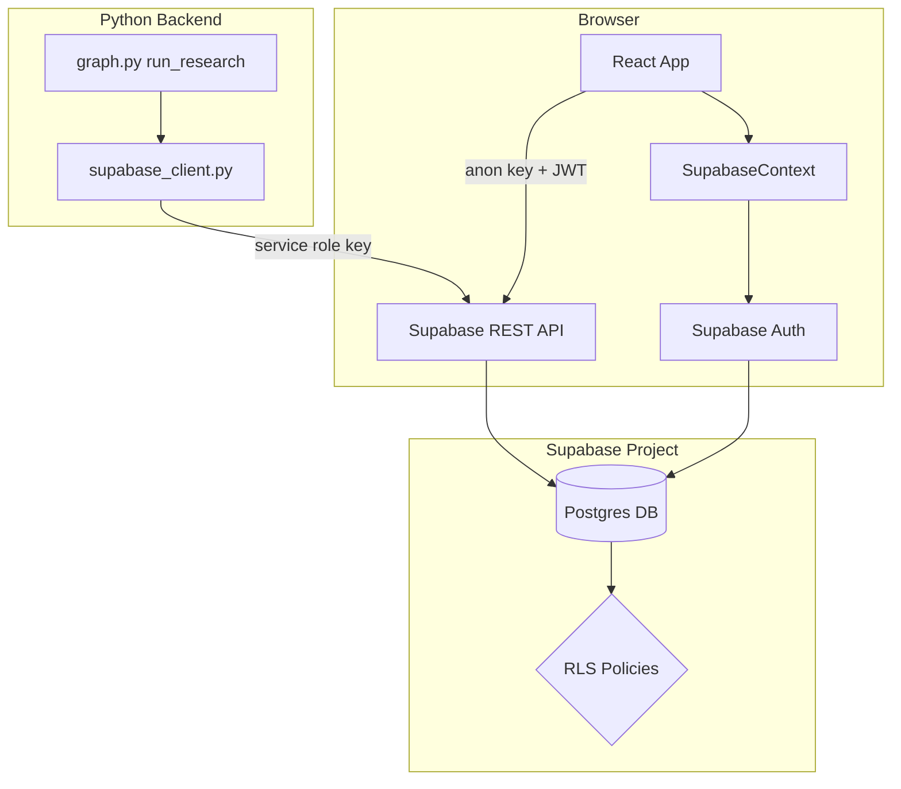
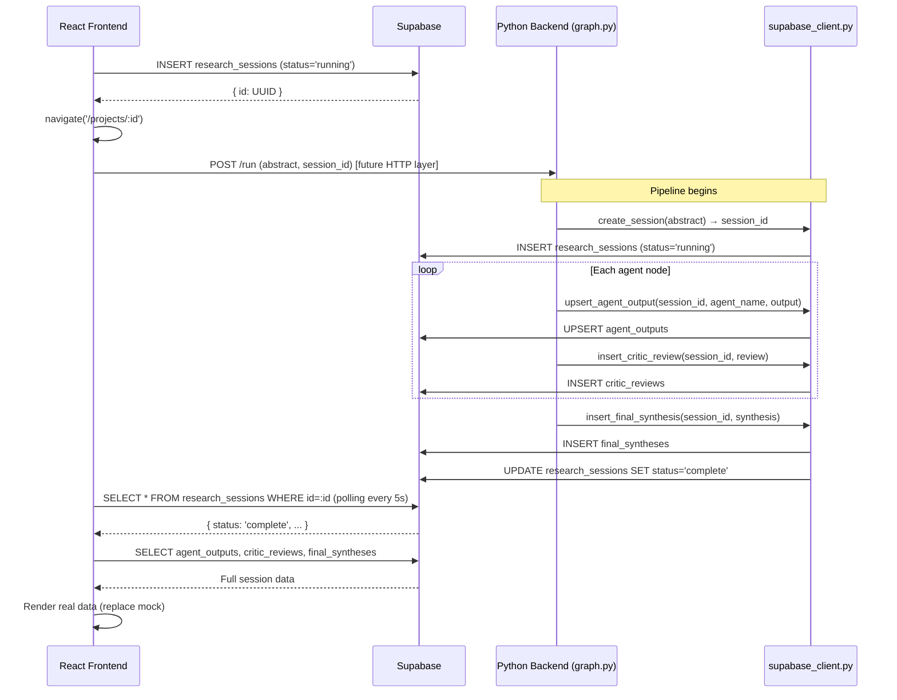
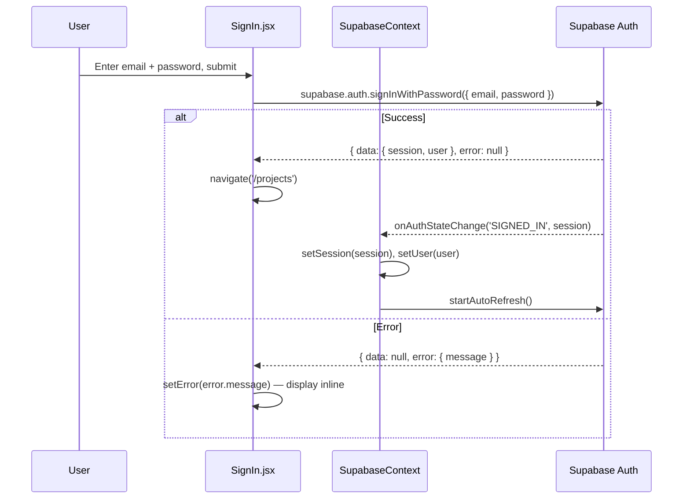
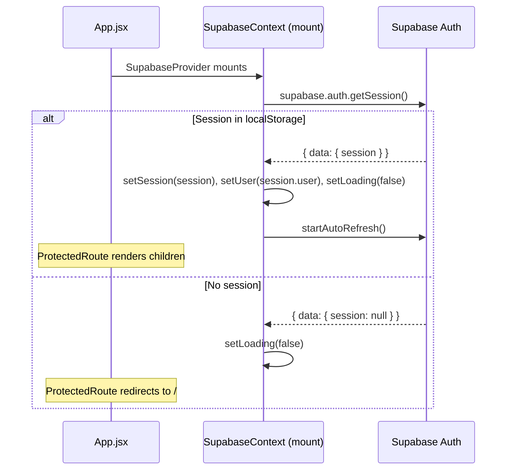
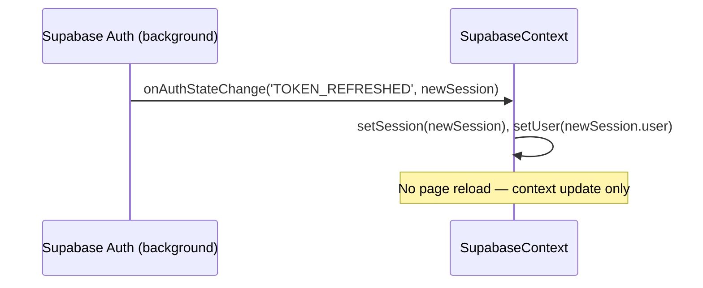
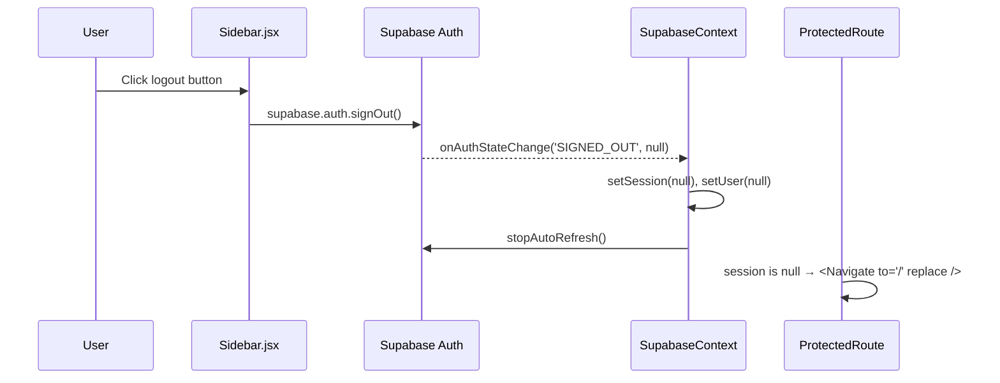
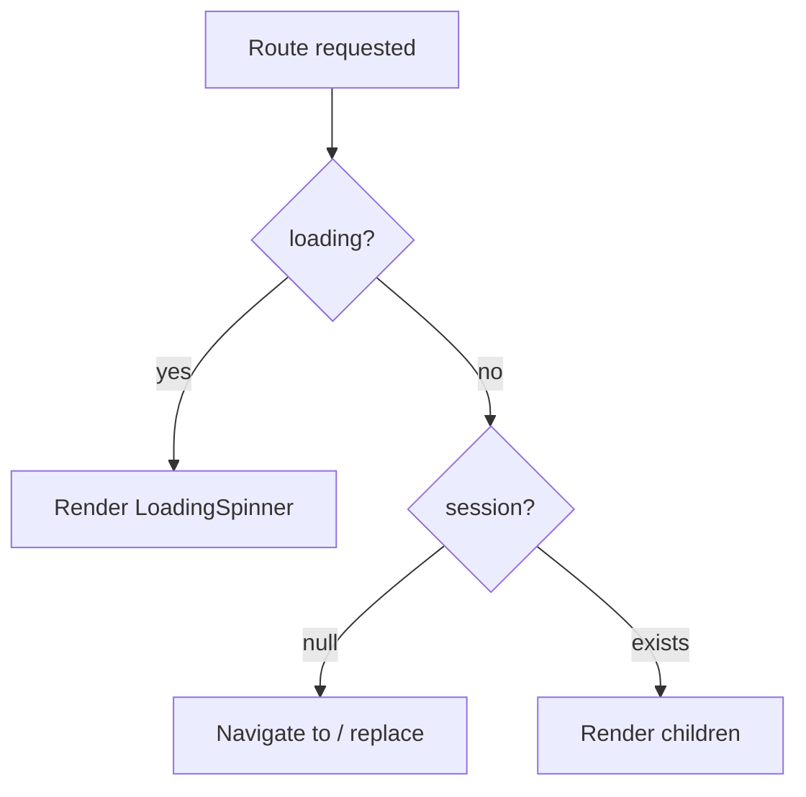

# Design Document — Supabase Integration

## Overview

This design integrates Supabase as the persistent data layer and authentication provider for LabOS. The Python LangGraph pipeline writes all research session data to Supabase after each pipeline run using the `supabase-py` client with the service role key. The React/Vite frontend reads that data back using the `@supabase/supabase-js` client with the anon key, replacing all hardcoded mock data. Supabase Auth gates the entire frontend, replacing the current no-op sign-in form.

The integration touches two independent codebases that share a single Supabase project:

- **Python backend** (`research_lab/`) — write-only, synchronous, service role key, isolated in `supabase_client.py`
- **React frontend** (`labos-mockup/`) — read/write via RLS-enforced anon key, session managed by `SupabaseContext`

Key constraints that shape every decision in this design:
- All Python code is **synchronous** — no `async/await`, no event loops
- The service role key **never** leaves the Python backend
- The anon key **never** appears in Python code
- All frontend Supabase calls go through `api.js` — no raw `supabase.from()` in component files
- Supabase write failures in the backend **do not abort** the research pipeline

---

## Architecture

### System-Level View



### Data Flow: Pipeline Run → Supabase → Frontend



---

## Components and Interfaces

### Python Backend

#### `research_lab/supabase_client.py` (new file)

This module is the **only** place in the Python codebase that imports or references Supabase. It exposes a clean functional API that `graph.py` calls at each pipeline stage.

```python
# Public interface

def get_client() -> Client:
    """Return the singleton supabase-py Client, initialised lazily from env vars."""

def create_session(abstract: str) -> str:
    """
    Insert a research_sessions row with status='running'.
    Returns the new session UUID as a string.
    Raises SupabaseWriteError on failure (caller catches and continues).
    """

def upsert_agent_output(
    session_id: str,
    agent_name: str,   # 'literature' | 'hypothesis' | 'procedure'
    revision_count: int,
    output: dict,
) -> None:
    """
    Upsert a row in agent_outputs.
    Uses ON CONFLICT (session_id, agent_name) DO UPDATE so retries are idempotent.
    Logs and swallows any Supabase error — never raises.
    """

def insert_critic_review(
    session_id: str,
    review: CriticReview,
) -> None:
    """
    Insert a row in critic_reviews.
    Logs and swallows any Supabase error — never raises.
    """

def insert_final_synthesis(
    session_id: str,
    final_recommendation: str,
    confidence_level: str,
    action_items: list,
    caveats: list,
) -> None:
    """
    Insert a row in final_syntheses and update research_sessions.status to 'complete'.
    Logs and swallows any Supabase error — never raises.
    """

def mark_session_error(session_id: str, error_message: str) -> None:
    """
    Update research_sessions SET status='error', error=error_message.
    Logs and swallows any Supabase error — never raises.
    """
```

**Singleton pattern** — the `supabase-py` `Client` is created once at module level using a lazy initialiser guarded by a module-level variable. This avoids re-creating the client on every call while remaining compatible with synchronous execution.

**Error handling contract** — every public function (except `get_client`) wraps its Supabase call in `try/except Exception`. On failure it calls `logger.error(...)` with the error message (never the key value) and returns without raising. This ensures Supabase write failures never abort the research pipeline (Requirement 2.8).

#### `research_lab/graph.py` — integration points

`graph.py` imports only from `supabase_client` and calls it at five points:

| Graph node | `supabase_client` call |
|---|---|
| `run_research()` entry | `create_session(abstract)` → stores `session_id` in `ResearchState` |
| `dispatch_literature` / `dispatch_hypothesis` / `dispatch_procedure` (after success) | `upsert_agent_output(session_id, agent_name, revision_count, output)` |
| `review_literature_node` / `review_hypothesis_node` / `review_procedure_node` | `insert_critic_review(session_id, review)` |
| `synthesize_node` (after success) | `insert_final_synthesis(session_id, ...)` |
| Any node `except` block | `mark_session_error(session_id, str(e))` |

`ResearchState` gains one new field: `session_id: Optional[str]` — set by `run_research()` after `create_session()` returns, then threaded through all nodes.

### React Frontend

#### `labos-mockup/src/lib/supabase.js` (new file)

```js
import { createClient } from '@supabase/supabase-js'

const supabaseUrl = import.meta.env.VITE_SUPABASE_URL
const supabaseAnonKey = import.meta.env.VITE_SUPABASE_ANON_KEY

export const supabase = createClient(supabaseUrl, supabaseAnonKey)
```

Single export: `supabase`. No other logic. Never references `SERVICE_ROLE_KEY`.

#### `labos-mockup/src/context/SupabaseContext.jsx` (new file)

```jsx
// Exports:
export const SupabaseContext = createContext(null)
export function SupabaseProvider({ children }) { ... }
export function useSupabase() { ... }  // throws if used outside provider
```

Context value shape:
```js
{
  session: Session | null,   // supabase-js Session object
  user: User | null,         // supabase-js User object
  loading: boolean,          // true until getSession() resolves on mount
}
```

Lifecycle:
1. On mount: call `supabase.auth.getSession()` → set `session`, `user`, `loading = false`
2. Subscribe: `supabase.auth.onAuthStateChange((event, session) => { ... })`
   - `SIGNED_IN` / `TOKEN_REFRESHED`: update `session` and `user`, call `startAutoRefresh()`
   - `SIGNED_OUT`: clear `session` and `user`, call `stopAutoRefresh()`
3. On unmount: call `subscription.unsubscribe()`

#### `labos-mockup/src/components/Auth/ProtectedRoute.jsx` (new file)

```jsx
export default function ProtectedRoute({ children }) {
  const { session, loading } = useSupabase()

  if (loading) return <LoadingSpinner />
  if (!session) return <Navigate to="/" replace />
  return children
}
```

Used in `App.jsx` to wrap the `<Layout />` route element.

#### `labos-mockup/src/lib/api.js` (new file)

All Supabase data operations for the frontend. No component file may call `supabase.from(...)` directly.

```js
// Sessions
export async function fetchSessions()           // ProjectList, Sidebar
export async function fetchRecentSessions(n)    // Sidebar (n=5)
export async function createSession(abstract)   // NewProject
export async function fetchSessionById(id)      // ProjectDashboard

// Agent data
export async function fetchAgentOutputs(sessionId)   // ProjectDashboard
export async function fetchCriticReviews(sessionId)  // ProjectDashboard
export async function fetchFinalSynthesis(sessionId) // ProjectDashboard
```

Each function:
- Calls `supabase.from(...).select(...)` (or `.insert(...)`)
- Returns `{ data, error }` — callers check `error` and handle 401/403 by calling `supabase.auth.signOut()` then navigating to `/`
- Is `async` — callers use `await` inside `useEffect`

#### Modified files

| File | Changes |
|---|---|
| `App.jsx` | Wrap app in `<SupabaseProvider>`. Wrap `<Layout />` route in `<ProtectedRoute>`. |
| `SignIn.jsx` | Add password field. Wire `handleSignIn` to `supabase.auth.signInWithPassword`. Add error display. Wire SSO button to `supabase.auth.signInWithOAuth`. |
| `ProjectList.jsx` | Replace hardcoded `projects` array with `useEffect` → `api.fetchSessions()`. Add loading skeleton and error state. |
| `ProjectDashboard.jsx` | Replace mock data and timers with `useEffect` → `api.fetchSessionById` + `api.fetchAgentOutputs` + `api.fetchCriticReviews` + `api.fetchFinalSynthesis`. Add 5-second polling when `status === 'running'`. |
| `NewProject.jsx` | Replace `setTimeout` + random ID with `api.createSession(abstract)` → navigate to returned UUID. |
| `Sidebar.jsx` | Replace hardcoded `recentProjects` with `useEffect` → `api.fetchRecentSessions(5)`. Wire logout button to `supabase.auth.signOut()` + navigate. |

---

## Data Models

### Supabase Schema (SQL DDL)

```sql
-- ── Extensions ────────────────────────────────────────────────────────────────
-- gen_random_uuid() is available by default in Supabase (pgcrypto extension)

-- ── Tables ────────────────────────────────────────────────────────────────────

CREATE TABLE public.research_sessions (
    id            UUID        PRIMARY KEY DEFAULT gen_random_uuid(),
    user_id       UUID        NOT NULL REFERENCES auth.users(id) ON DELETE CASCADE,
    abstract      TEXT        NOT NULL,
    status        TEXT        NOT NULL CHECK (status IN ('running', 'complete', 'error')),
    error         TEXT,                          -- populated on status='error'
    created_at    TIMESTAMPTZ NOT NULL DEFAULT now(),
    updated_at    TIMESTAMPTZ NOT NULL DEFAULT now()
);

CREATE TABLE public.agent_outputs (
    id             UUID        PRIMARY KEY DEFAULT gen_random_uuid(),
    session_id     UUID        NOT NULL REFERENCES public.research_sessions(id) ON DELETE CASCADE,
    agent_name     TEXT        NOT NULL CHECK (agent_name IN ('literature', 'hypothesis', 'procedure')),
    revision_count INTEGER     NOT NULL,
    output_json    JSONB       NOT NULL,
    created_at     TIMESTAMPTZ NOT NULL DEFAULT now(),
    UNIQUE (session_id, agent_name)              -- supports upsert by (session_id, agent_name)
);

CREATE TABLE public.critic_reviews (
    id              UUID        PRIMARY KEY DEFAULT gen_random_uuid(),
    session_id      UUID        NOT NULL REFERENCES public.research_sessions(id) ON DELETE CASCADE,
    agent_name      TEXT        NOT NULL,
    revision_number INTEGER     NOT NULL,
    passed          BOOLEAN     NOT NULL,
    feedback        TEXT,
    reviewed_at     TIMESTAMPTZ NOT NULL
);

CREATE TABLE public.final_syntheses (
    id                   UUID        PRIMARY KEY DEFAULT gen_random_uuid(),
    session_id           UUID        NOT NULL UNIQUE REFERENCES public.research_sessions(id) ON DELETE CASCADE,
    final_recommendation TEXT,
    confidence_level     TEXT        CHECK (confidence_level IN ('High', 'Moderate', 'Low')),
    action_items         JSONB,
    caveats              JSONB,
    created_at           TIMESTAMPTZ NOT NULL DEFAULT now()
);

-- ── updated_at trigger ────────────────────────────────────────────────────────

CREATE OR REPLACE FUNCTION public.set_updated_at()
RETURNS TRIGGER LANGUAGE plpgsql AS $$
BEGIN
    NEW.updated_at = now();
    RETURN NEW;
END;
$$;

CREATE TRIGGER research_sessions_updated_at
    BEFORE UPDATE ON public.research_sessions
    FOR EACH ROW EXECUTE FUNCTION public.set_updated_at();

-- ── Row-Level Security ────────────────────────────────────────────────────────

ALTER TABLE public.research_sessions  ENABLE ROW LEVEL SECURITY;
ALTER TABLE public.agent_outputs       ENABLE ROW LEVEL SECURITY;
ALTER TABLE public.critic_reviews      ENABLE ROW LEVEL SECURITY;
ALTER TABLE public.final_syntheses     ENABLE ROW LEVEL SECURITY;

-- research_sessions: owner-only access
CREATE POLICY "sessions_select_own" ON public.research_sessions
    FOR SELECT USING (user_id = auth.uid());

CREATE POLICY "sessions_insert_own" ON public.research_sessions
    FOR INSERT WITH CHECK (user_id = auth.uid());

CREATE POLICY "sessions_update_own" ON public.research_sessions
    FOR UPDATE USING (user_id = auth.uid());

-- agent_outputs: access via parent session ownership
CREATE POLICY "agent_outputs_select_own" ON public.agent_outputs
    FOR SELECT USING (
        session_id IN (
            SELECT id FROM public.research_sessions WHERE user_id = auth.uid()
        )
    );

CREATE POLICY "agent_outputs_insert_own" ON public.agent_outputs
    FOR INSERT WITH CHECK (
        session_id IN (
            SELECT id FROM public.research_sessions WHERE user_id = auth.uid()
        )
    );

CREATE POLICY "agent_outputs_update_own" ON public.agent_outputs
    FOR UPDATE USING (
        session_id IN (
            SELECT id FROM public.research_sessions WHERE user_id = auth.uid()
        )
    );

-- critic_reviews: access via parent session ownership
CREATE POLICY "critic_reviews_select_own" ON public.critic_reviews
    FOR SELECT USING (
        session_id IN (
            SELECT id FROM public.research_sessions WHERE user_id = auth.uid()
        )
    );

CREATE POLICY "critic_reviews_insert_own" ON public.critic_reviews
    FOR INSERT WITH CHECK (
        session_id IN (
            SELECT id FROM public.research_sessions WHERE user_id = auth.uid()
        )
    );

-- final_syntheses: access via parent session ownership
CREATE POLICY "final_syntheses_select_own" ON public.final_syntheses
    FOR SELECT USING (
        session_id IN (
            SELECT id FROM public.research_sessions WHERE user_id = auth.uid()
        )
    );

CREATE POLICY "final_syntheses_insert_own" ON public.final_syntheses
    FOR INSERT WITH CHECK (
        session_id IN (
            SELECT id FROM public.research_sessions WHERE user_id = auth.uid()
        )
    );
```

### `ResearchState` additions (`state.py`)

```python
class ResearchState(TypedDict):
    # ... existing fields unchanged ...

    # New field — set by run_research() after create_session() returns
    session_id: Optional[str]
```

### Frontend data shapes (TypeScript-style for clarity)

```ts
// Mirrors research_sessions table row
interface ResearchSession {
  id: string
  user_id: string
  abstract: string
  status: 'running' | 'complete' | 'error'
  error: string | null
  created_at: string
  updated_at: string
}

// Mirrors agent_outputs table row
interface AgentOutput {
  id: string
  session_id: string
  agent_name: 'literature' | 'hypothesis' | 'procedure'
  revision_count: number
  output_json: Record<string, unknown>
  created_at: string
}

// Mirrors critic_reviews table row
interface CriticReview {
  id: string
  session_id: string
  agent_name: string
  revision_number: number
  passed: boolean
  feedback: string | null
  reviewed_at: string
}

// Mirrors final_syntheses table row
interface FinalSynthesis {
  id: string
  session_id: string
  final_recommendation: string | null
  confidence_level: 'High' | 'Moderate' | 'Low' | null
  action_items: string[] | null
  caveats: string[] | null
  created_at: string
}
```

---

## Auth Flow Diagrams

### Sign-In Flow



### Session Restore on App Load



### Token Refresh Flow



### Sign-Out Flow



### Protected Route Guard



---

## Correctness Properties

*A property is a characteristic or behavior that should hold true across all valid executions of a system — essentially, a formal statement about what the system should do. Properties serve as the bridge between human-readable specifications and machine-verifiable correctness guarantees.*

### Property 1: RLS user isolation

*For any* two distinct authenticated user IDs (user A and user B), any `research_sessions` row inserted by user A — and any child rows in `agent_outputs`, `critic_reviews`, or `final_syntheses` linked to that session — should return an empty result set when queried using user B's JWT.

**Validates: Requirements 1.5, 5.5**

---

### Property 2: `updated_at` trigger monotonicity

*For any* `research_sessions` row, after any UPDATE operation on that row, the `updated_at` column value should be greater than or equal to its value immediately before the update.

**Validates: Requirements 1.7**

---

### Property 3: Agent output write round-trip

*For any* valid agent name (`'literature'`, `'hypothesis'`, `'procedure'`), any non-negative revision count, and any dict that is JSON-serialisable, calling `upsert_agent_output(session_id, agent_name, revision_count, output)` should result in a row retrievable from `agent_outputs` whose `output_json` field is equal to the original dict.

**Validates: Requirements 2.3**

---

### Property 4: Critic review write round-trip

*For any* `CriticReview` dict with valid fields, calling `insert_critic_review(session_id, review)` should result in a row retrievable from `critic_reviews` whose `passed`, `feedback`, `agent_name`, and `revision_number` fields match the original review.

**Validates: Requirements 2.4**

---

### Property 5: Supabase write failure does not abort pipeline

*For any* mocked Supabase write failure (network error, timeout, or API error) injected at any point in the pipeline, `run_research(abstract)` should return a `ResearchState` dict (not raise an exception) and the pipeline should complete its agent execution sequence.

**Validates: Requirements 2.8**

---

### Property 6: Service role key never appears in log output

*For any* pipeline execution with a non-empty `SUPABASE_SERVICE_ROLE_KEY` environment variable, no string produced by any logging call in `supabase_client.py` or `graph.py` should contain the literal value of that key.

**Validates: Requirements 2.7, 5.4**

---

### Property 7: ProtectedRoute redirects all unauthenticated requests

*For any* route path wrapped by `ProtectedRoute`, when `session` is `null` and `loading` is `false`, the rendered output should be a redirect to `'/'` rather than the protected content.

**Validates: Requirements 3.8**

---

### Property 8: 401/403 responses trigger sign-out

*For any* `api.js` function call that receives a Supabase error with status `401` or `403`, `supabase.auth.signOut()` should be called and the user should be redirected to the sign-in page.

**Validates: Requirements 5.6**

---

### Property 9: Polling continues while session is running

*For any* session with `status = 'running'`, the ProjectDashboard polling loop should schedule a re-fetch at 5-second intervals and should not call `supabase.auth.signOut()` regardless of how many polling cycles have elapsed.

**Validates: Requirements 4.6, 6.5**

---

## Error Handling

### Python Backend

| Failure scenario | Handling |
|---|---|
| `SUPABASE_URL` or `SUPABASE_SERVICE_ROLE_KEY` not set | `get_client()` raises `EnvironmentError` at startup — fail fast before any pipeline work |
| `create_session()` fails | `run_research()` catches, logs, sets `session_id = None`, continues pipeline without persistence |
| `upsert_agent_output()` fails | Logs error, returns `None`, pipeline continues |
| `insert_critic_review()` fails | Logs error, returns `None`, pipeline continues |
| `insert_final_synthesis()` fails | Logs error, returns `None`, pipeline continues |
| Any agent node raises exception | Existing `except` block in graph node calls `mark_session_error(session_id, str(e))` then sets `state["error"]` |
| `mark_session_error()` itself fails | Logs error, swallows — never re-raises |

**Key invariant**: the `supabase_client` module uses Python's `logging` module (not `print`). Log messages include the error type and a truncated message but never the key value or full stack trace containing secrets.

### React Frontend

| Failure scenario | Handling |
|---|---|
| `VITE_SUPABASE_URL` or `VITE_SUPABASE_ANON_KEY` not set | `createClient` will produce a non-functional client; all API calls will fail with a clear error. App should display a configuration error banner. |
| `signInWithPassword` error | Display `error.message` inline below the form. Do not navigate. |
| `fetchSessions()` error | ProjectList shows inline error message + retry button |
| `fetchSessionById()` error | ProjectDashboard shows error card with session ID |
| 401 / 403 from any `api.js` call | Call `supabase.auth.signOut()`, navigate to `/` |
| Session `status = 'error'` | ProjectDashboard renders an error state card with the `error` field value |
| Polling fetch fails | Log error, continue polling (transient network failure should not stop the loop) |

---

## Testing Strategy

### Unit Tests

Unit tests cover specific examples, edge cases, and error conditions. They should be fast and require no network access.

**Python (`research_lab/tests/test_supabase_client.py`)**:
- `test_create_session_returns_uuid` — mock supabase client, verify UUID string returned
- `test_upsert_agent_output_swallows_error` — mock client to raise, verify no exception propagates
- `test_insert_critic_review_swallows_error` — same pattern
- `test_mark_session_error_swallows_error` — same pattern
- `test_get_client_raises_on_missing_env` — unset env vars, verify `EnvironmentError`
- `test_log_output_excludes_key` — verify key value not in any log record

**React (`labos-mockup/src/tests/`)**:
- `ProtectedRoute.test.jsx` — render with `session=null`, verify redirect; render with session, verify children
- `SupabaseContext.test.jsx` — verify `getSession()` called on mount; verify `SIGNED_OUT` clears state; verify `TOKEN_REFRESHED` updates state; verify unsubscribe on unmount
- `SignIn.test.jsx` — verify password field present; verify `signInWithPassword` called on submit; verify error displayed on failure
- `api.test.js` — verify each function calls the correct Supabase table and method

### Property-Based Tests

Property-based testing is applicable to this feature for the data persistence round-trips, RLS enforcement, and resilience properties. The recommended library is **Hypothesis** for Python and **fast-check** for JavaScript.

**Python property tests (`research_lab/tests/test_supabase_properties.py`)** using Hypothesis:

Each test runs a minimum of 100 iterations.

- **Property 3** (`test_agent_output_round_trip`): Generate random `agent_name` from the valid set, random `revision_count` (0–10), and random JSON-serialisable dict. Verify round-trip via mocked client.
- **Property 4** (`test_critic_review_round_trip`): Generate random `CriticReview` dicts with varied `passed`, `feedback`, `agent_name`, `revision_number`. Verify round-trip.
- **Property 5** (`test_write_failure_does_not_abort_pipeline`): Generate random exception types from a set (ConnectionError, TimeoutError, ValueError). Inject at random pipeline stages via mock. Verify `run_research()` returns a `ResearchState`.
- **Property 6** (`test_key_never_in_logs`): Generate random abstract strings. Run pipeline with mocked Supabase. Collect all log records. Verify key value absent.

Tag format: `# Feature: supabase-integration, Property {N}: {property_text}`

**JavaScript property tests (`labos-mockup/src/tests/properties/`)** using fast-check:

- **Property 7** (`protectedRoute.property.test.jsx`): Generate random route paths. Render `ProtectedRoute` with `session=null`. Verify redirect for all paths.
- **Property 8** (`api.property.test.js`): Generate random API function names from the `api.js` exports. Mock Supabase to return 401 or 403. Verify `signOut` called for all functions.
- **Property 9** (`polling.property.test.jsx`): Generate random numbers of polling cycles (1–20). Verify `signOut` never called during polling of a `status='running'` session.

### Integration Tests

Integration tests require a real Supabase project (or a local Supabase instance via `supabase start`). They are run separately from unit/property tests.

- **Property 1** (RLS isolation): Create two test users via Supabase Admin API. Insert session as user A. Query as user B. Verify empty result.
- **Property 2** (trigger): Insert a session row. Record `updated_at`. Update the row. Verify new `updated_at >= old updated_at`.
- End-to-end: Run `run_research(DEMO_ABSTRACT)` against a real Supabase project. Verify all four tables have rows for the session.

### Dependency additions

**`research_lab/requirements.txt`** — add:
```
supabase==2.15.0
```

**`labos-mockup/package.json`** — add to `dependencies`:
```json
"@supabase/supabase-js": "2.49.4"
```

(Exact versions pinned per project convention.)
